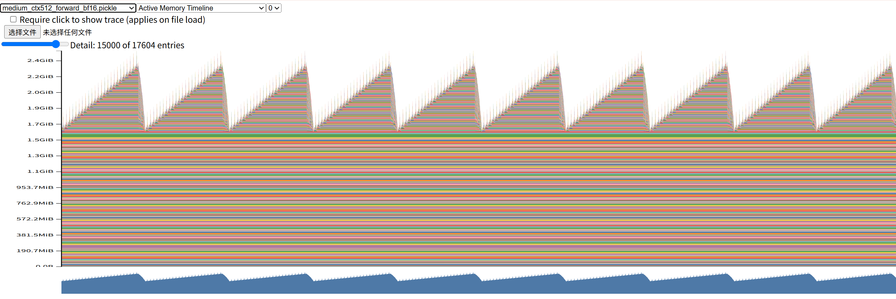
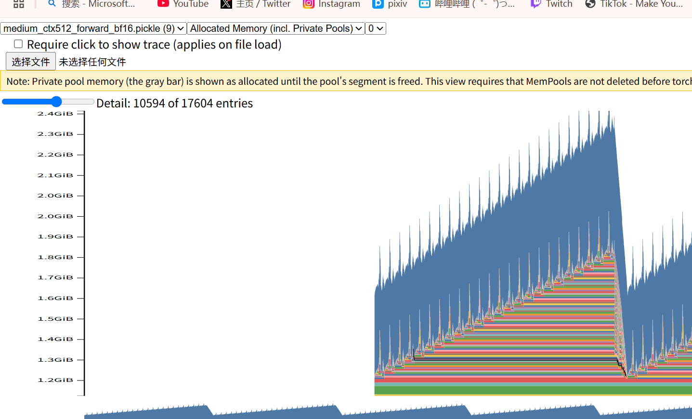
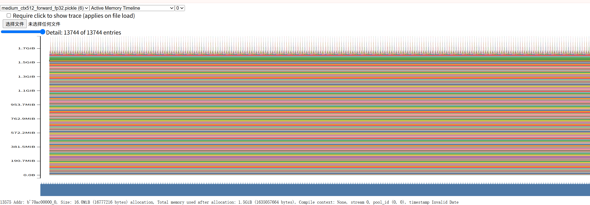
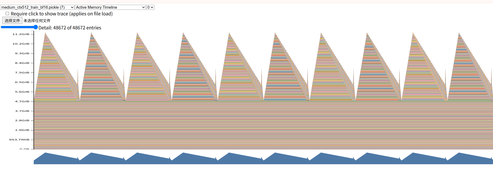
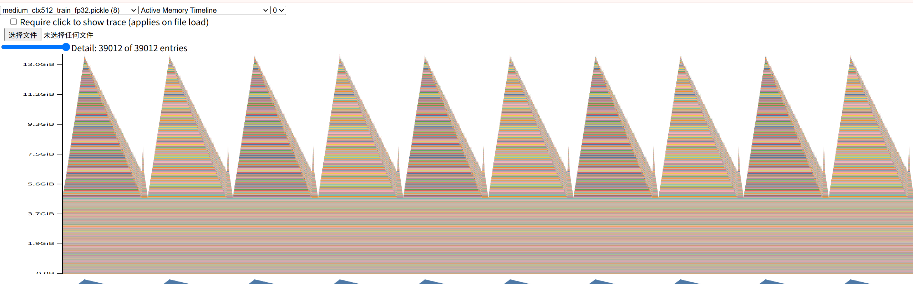
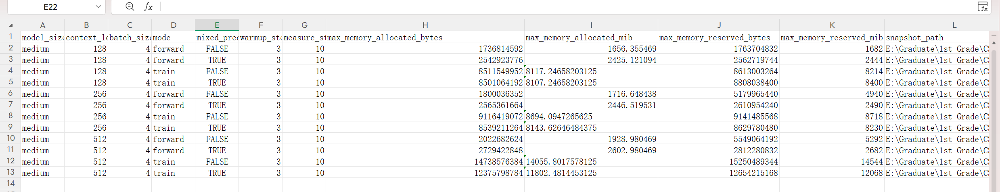
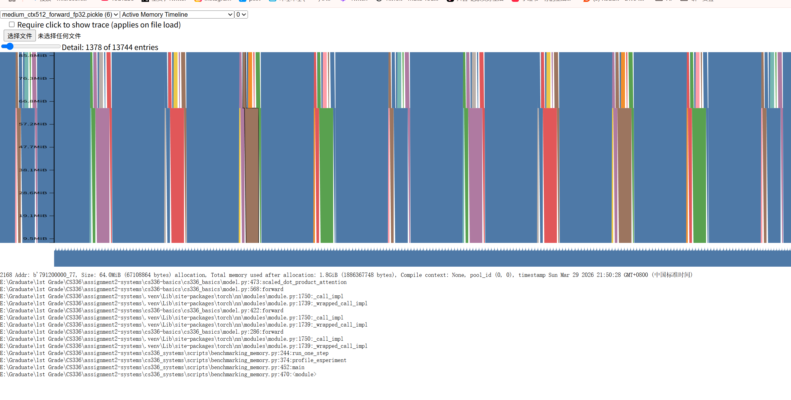
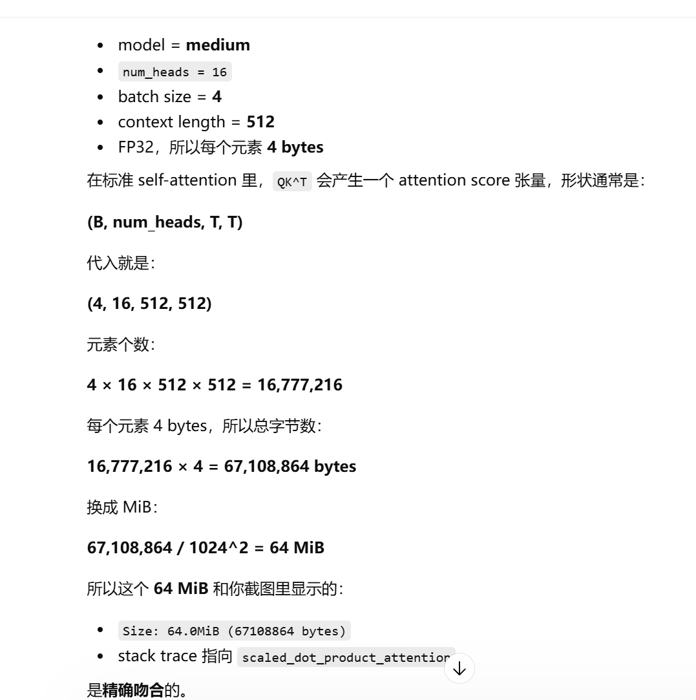

# How to run

```bash
uv run python cs336_systems/scripts/benchmarking_memory.py
```

# Question A

> Add an option to your profiling script to run your model through the memory profiler. It may be helpful to reuse some of your previous infrastructure (e.g., to activate mixed-precision, load specific model sizes, etc). Then, run your script to get a memory profile of the 2.7B model when either doing inference only (just forward pass) or a full training step. How do your memory timelines look like? Can you tell which stage is running based on the peaks you see? Deliverable: Two images of the “Active memory timeline” of a 2.7B model, from the memory\_viz tool: one for the forward pass, and one for running a full training step (forward and backward passes, then optimizer step), and a 2–3 sentence response.

> forward 的bf16版本和train相比十分明显，但fp32内存较平缓。
> bf16的版本，最高内存比fp32高，可能的原因是（gpt）运行中也会引入额外的 dtype conversion 和临时缓冲区。第一类是 ​**cast 之后的新张量**​。
> 因为 autocast 不是把原来的参数原地改成 bf16，而是很多时候在算某个算子前，临时把输入或权重变成 bf16 版本来算。这样就可能同时出现：

> * 原来的 fp32 参数

> * 临时生成的 bf16 输入

> * 临时生成的 bf16 权重视图或副本

> * 算完后的输出张量

> 这些临时 bf16 张量就是我说的“中间活跃对象”。结果是在 active memory timeline 中，BF16 版本出现了比 FP32 更明显的周期性峰谷，甚至峰值也可能更高。

* model_size seq_len mod precision
* medium 512 forward bf16

> 
> 
> 仔细看每一个forward，上升时有24个小尖刺，medium模型正好时24个layer

* medium 512 forward fp32

> 

* medium 512 train bf16

> 

* medium 512 train fp32

> 
> train再下降的时候有24个小尖刺

# Question B

> What is the peak memory usage of each context length when doing a forward pass? What about when doing a full training step? Deliverable: A table with two numbers per context length.
> 
> 
> | Context length | Forward peak memory (MiB) | Full training step peak memory (MiB) |
|---|---:|---:|
| 128 | 1656.355469 | 8117.246582 |
| 256 | 1716.648438 | 8694.094727 |
| 512 | 1928.980469 | 14055.801758 |
> 
> 

# Question C

> Find the peak memory usage of the 2.7B model when using mixed-precision, for both a forward pass and a full optimizer step. Does mixed-precision significantly affect memory usage? Deliverable: A 2–3 sentence response.

> 这里用的是medium模型

| Context length | Mixed-precision forward peak memory (MiB) | Mixed-precision full training step peak memory (MiB) |
|---|---:|---:|
| 128 | 2425.121094 | 8107.246582 |
| 256 | 2446.519531 | 8143.626465 |
| 512 | 2602.980469 | 11802.481445 |

In these results, mixed precision does not uniformly reduce memory usage: it increases forward-pass peak memory compared with the FP32 baseline,for the forward-only step, autocast creates a bf16 copy of the float parameters.  but reduces peak memory for the full training step, with the reduction becoming more noticeable at larger context length.

# Question D

> Consider the 2.7B model. At our reference hyperparameters, what is the size of a tensor of activations in the Transformer residual stream, in single-precision? Give this size in MB (i.e., divide the number of bytes by 1024^2). Deliverable: A 1–2 sentence response with your derivation.

> 对于本实验的medium大小，残差流大小如下：
> 对于 **medium** 模型：

- batch size = 4
- `d_model = 1024`
- residual stream 的一个激活张量形状是
  **(B, T, d_model) = (4, T, 1024)**

所以元素总数是：

`4 × T × 1024`

题目说是 **single-precision**，也就是 **FP32**，每个元素占 **4 bytes**。

因此张量大小为：

`4 × T × 1024 × 4 bytes`

先化简：

`= 16384T bytes`

再换成 MiB，要除以 `1024^2 = 1048576`：

`size(MiB) = 16384T / 1048576 = T / 64 MiB`

所以 medium 模型下，一个 residual stream 激活张量的大小就是：

- `T = 128` 时：`128 / 64 = 2 MiB`
- `T = 256` 时：`256 / 64 = 4 MiB`
- `T = 512` 时：`512 / 64 = 8 MiB`
- `T = 1024` 时：`1024 / 64 = 16 MiB`

因此，**medium 模型中，一个 residual stream 激活张量的大小公式是：**

`size(MiB) = T / 64`

# Question E

> Now look closely at the “Active Memory Timeline” from pytorch.org/memory\_viz of a memory snapshot of the 2.7B model doing a forward pass. When you reduce the “Detail” level, the tool hides the smallest allocations to the corresponding level (e.g., putting “Detail” at 10% only shows the 10% largest allocations). What is the size of the largest allocations shown? Looking through the stack trace, can you tell where those allocations come from? Deliverable: A 1–2 sentence response.
> 
> 是的，​**从你这张截图本身看，当前点到的这类最大 allocation 是 64.0 MiB（67108864 bytes）**​，而且 stack trace 显示它来自 `cs336_basics/model.py` 里的 `scaled_dot_product_attention`，也就是注意力前向过程中的大中间张量。
> 

