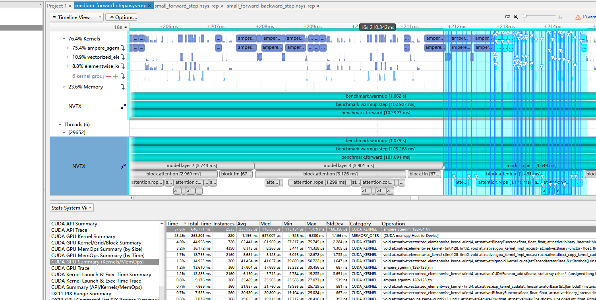
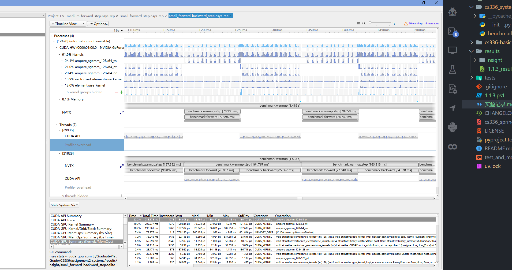
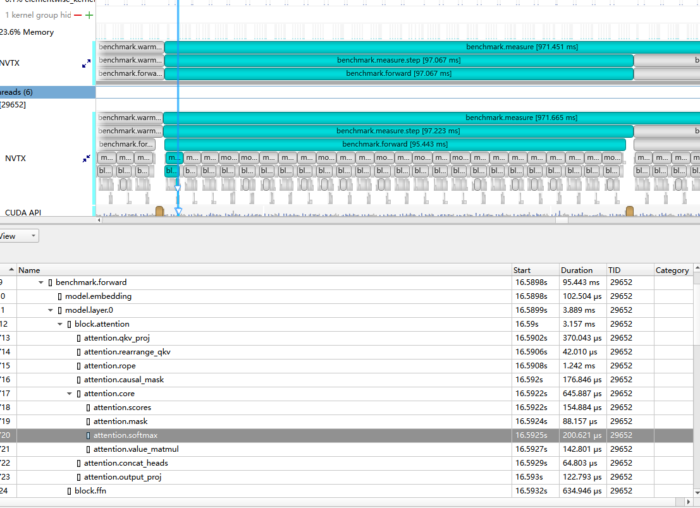

# 注意事项
## 用管理员权限启动vscode/命令行
## 启动环境命令：
```bash
.\.venv\Scripts\Activate.ps1
```
# CUDA / GPU 环境修复流程

## 背景与问题定位

- 当前机器硬件为 `NVIDIA GeForce RTX 3070`，驱动信息可正常识别 GPU。
- 项目最初实际运行在 CPU 上，而不是 CUDA GPU 上。
- 已确认问题不在 [`cs336_systems/benchmark.py`](e:/研究生/研一/CS336/assignment2-systems/cs336_systems/benchmark.py) 的设备选择逻辑，而在 Python 环境里安装的是 CPU 版 `torch`。
- 当时检查到的现象是：
  - `torch.__version__` 为 `2.6.0+cpu`
  - `torch.backends.cuda.is_built()` 为 `False`
  - `torch.cuda.is_available()` 为 `False`
- 之后尝试安装 CUDA 版 `torch` 时下载/安装过程被中断，所以当前 `.venv` 里的 `torch` 还存在“安装残缺”的风险；因此优先推荐重建虚拟环境。

## 我已修改的文件与配置

### 修改 [`pyproject.toml`](e:/研究生/研一/CS336/assignment2-systems/pyproject.toml)

目标是让项目在 Windows / Linux 上优先安装 PyTorch 官方 `cu124` 的 CUDA 版 `torch`，同时避免 `uv` 因无关平台约束卡住解析。

已做的修改如下：

1. 保留非 Intel Mac 平台使用 `torch 2.6.0`：

```toml
"torch~=2.6.0; sys_platform != 'darwin' or platform_machine != 'x86_64'"
```

2. 保留 Intel Mac 兼容分支，但限制在 Python 3.12 以下：

```toml
"torch~=2.2.2; sys_platform == 'darwin' and platform_machine == 'x86_64' and python_version < '3.12'"
```

3. 在 `[tool.uv.sources]` 中，将 Windows / Linux 的 `torch` 指向 PyTorch 官方 CUDA 源：

```toml
[tool.uv.sources]
cs336-basics = { path = "./cs336-basics", editable = true }
torch = [{ index = "pytorch-cu124", marker = "sys_platform == 'win32' or sys_platform == 'linux'" }]
```

4. 新增显式的 PyTorch CUDA index：

```toml
[[tool.uv.index]]
name = "pytorch-cu124"
url = "https://download.pytorch.org/whl/cu124"
explicit = true
```

5. 在 `[tool.uv]` 中限制依赖解析平台，避免 Intel Mac 这一类当前不相关的平台影响解析：

```toml
[tool.uv]
package = true
python-preference = "managed"
environments = [
    "sys_platform == 'win32'",
    "sys_platform == 'linux'",
    "sys_platform == 'darwin' and platform_machine == 'arm64'",
]
```

### 与 GPU 相关的其他文件说明

- [`cs336_systems/benchmark.py`](e:/研究生/研一/CS336/assignment2-systems/cs336_systems/benchmark.py) 不需要额外修改成“支持 GPU”，因为它本身已经具备：
  - 默认在 `torch.cuda.is_available()` 为真时使用 `cuda`
  - 可以手动传 `--device cuda`
  - 在 CUDA 计时时调用 `torch.cuda.synchronize()`
- 这次修复的重点是“环境与依赖配置”，不是 benchmark 脚本本身的设备选择逻辑。

## 你需要手动执行的完整流程

以下命令都在项目根目录 `e:\研究生\研一\CS336\assignment2-systems` 下执行。

### 第 0 步：先确认系统能看到 GPU

```powershell
nvidia-smi
```

期望结果：

- 能看到 `NVIDIA GeForce RTX 3070`
- 能看到驱动版本信息

### 第 1 步：优先采用方案 A，重建虚拟环境

适用场景：

- 之前安装 CUDA 版 `torch` 时中断过
- 当前 `.venv` 可能已经损坏
- 想用最稳妥的方式恢复环境

执行命令：

```powershell
Remove-Item -Recurse -Force .\.venv
uv sync --cache-dir .\.uv-cache-local --default-index https://pypi.tuna.tsinghua.edu.cn/simple
```

说明：

- 这里用了清华源 `https://pypi.tuna.tsinghua.edu.cn/simple` 来加速普通 PyPI 包下载。
- `torch` 不会从清华源安装，而是会根据 [`pyproject.toml`](e:/研究生/研一/CS336/assignment2-systems/pyproject.toml) 里的 `[tool.uv.sources]` 配置，去 PyTorch 官方 `cu124` 源下载 CUDA 版 wheel。
- 如果你只执行一个方案，就执行这一套，成功率最高。

### 第 2 步：如果你不想整环境重建，再尝试方案 B

适用场景：

- 想尽量少改动现有环境
- 只想替换当前 `.venv` 中的 `torch`

执行命令：

```powershell
uv pip install --python .\.venv\Scripts\python.exe --no-deps --reinstall "https://download.pytorch.org/whl/cu124/torch-2.6.0%2Bcu124-cp311-cp311-win_amd64.whl"
```

说明：

- 这是“直接安装官方 CUDA wheel”的方式。
- 这个 wheel 对应的是当前机器要用的组合：Windows + Python 3.11 + `torch 2.6.0` + CUDA 12.4。
- 如果这一步仍然报权限错误、文件占用或 `torch` 导入损坏，直接回到“第 1 步”，重建 `.venv`。

### 第 3 步：安装完成后先验证 `torch` 是否已变成 CUDA 版

```powershell
.\.venv\Scripts\python.exe -c "import torch; print('torch', torch.__version__); print('cuda_built', torch.backends.cuda.is_built()); print('cuda_version', torch.version.cuda); print('cuda_available', torch.cuda.is_available()); print('device_count', torch.cuda.device_count()); print('device_name', torch.cuda.get_device_name(0) if torch.cuda.is_available() else 'no cuda')"
```

期望结果：

- `torch` 版本不应再带 `+cpu`
- `cuda_built` 应为 `True`
- `cuda_available` 应为 `True`
- `device_name` 应显示 `NVIDIA GeForce RTX 3070`

### 第 4 步：做一次最小 GPU 张量计算验证

```powershell
.\.venv\Scripts\python.exe -c "import torch; x=torch.randn(1024,1024,device='cuda'); y=x@x; print(y.device, float(y.mean()))"
```

期望结果：

- 输出中的设备应为 `cuda:0`
- 不应出现 “CUDA not available” 或类似报错

### 第 5 步：验证项目 benchmark 是否真的在走 GPU

```powershell
.\.venv\Scripts\python.exe -m cs336_systems.benchmark --device cuda --mode forward --d-model 32 --d-ff 128 --num-layers 1 --num-heads 4 --batch-size 1 --context-length 8 --warmup-steps 1 --measure-steps 1
```

期望结果：

- benchmark 可以正常完成
- 输出配置中的 `device` 为 `cuda`
- 程序不会退回 CPU 路径

## 当前推荐

- 由于之前安装过程被中断，当前最推荐的执行方式仍然是“第 1 步：重建 `.venv`”。
- 如果你只是想先试一把、减少下载量，可以先跑“第 2 步”；一旦失败，再回到“第 1 步”。
- 这部分记录只覆盖 CUDA / GPU 环境修复流程，不替代后续实验内容本身。

# 1.1.3(a) End-to-End Benchmarking 记录

## 问题背景

- 本小节要求编写一个可直接运行的 benchmark 脚本，对基础 Transformer 模型做端到端计时。
- 脚本需要支持两种模式：
  - 仅测量前向传播
  - 同时测量前向传播和反向传播
- benchmark 的基本流程应包括：
  - 根据给定超参数初始化基础 Transformer
  - 生成随机输入 batch 与目标 batch
  - 先执行预热步数 `w`
  - 再正式测量 `n` 步
  - 每一步后在 CUDA 设备上调用 `torch.cuda.synchronize()`
- 当前实现文件为 [`cs336_systems/benchmark.py`](e:/研究生/研一/CS336/assignment2-systems/cs336_systems/benchmark.py)。

## 运行所需命令

### 查看脚本参数

```bash
uv run python -m cs336_systems.benchmark --help
```

### 仅测量前向传播

```bash
uv run python -m cs336_systems.benchmark --model-size small --context-length 128 --batch-size 4 --warmup-steps 5 --measure-steps 10 --mode forward
```

### 同时测量前向传播和反向传播

```bash
uv run python -m cs336_systems.benchmark \
  --model-size small \
  --context-length 128 \
  --batch-size 4 \
  --warmup-steps 5 \
  --measure-steps 10 \
  --mode forward-backward
```

### 手动覆盖模型超参数的示例

```bash
uv run python -m cs336_systems.benchmark \
  --mode forward-backward \
  --d-model 768 \
  --d-ff 3072 \
  --num-layers 12 \
  --num-heads 12 \
  --context-length 128 \
  --batch-size 4 \
  --warmup-steps 5 \
  --measure-steps 10
```

### 在 GPU 上运行的示例

```bash
uv run python -m cs336_systems.benchmark \
  --device cuda \
  --model-size small \
  --context-length 128 \
  --batch-size 4 \
  --warmup-steps 5 \
  --measure-steps 10 \
  --mode forward-backward
```

## 直接运行脚本
```bash
.\1.1.3.ps1
```
## 期望输出

### 交付文件位置

- benchmark 脚本文件位置：[`cs336_systems/benchmark.py`](e:/研究生/研一/CS336/assignment2-systems/cs336_systems/benchmark.py)
- benchmark 结果记录文件位置：[`results/1.1.3_results.csv`](e:/研究生/研一/CS336/assignment2-systems/results/1.1.3_results.csv)
- 实验说明记录文件位置：[`实验记录.md`](e:/研究生/研一/CS336/assignment2-systems/实验记录.md)

### 问题
#### (a) 编写端到端基准测试脚本

编写一个脚本，对你的模型的 forward 和 backward 过程进行基础的端到端性能测试。具体来说，你的脚本应支持以下功能：

- 给定超参数（例如层数），初始化一个模型。
- 生成一个随机 batch 的数据。
- 先运行 `w` 个预热步骤（warm-up steps，不计入测量时间），然后对 `n` 个步骤的执行时间进行计时  
  （具体测量内容由参数决定，可以只测 forward，也可以同时测 forward 和 backward）。
- 在计时时，可以使用 Python 的 `timeit` 模块  
  （例如使用 `timeit` 函数，或者使用 `timeit.default_timer()`。后者会提供系统可用的最高精度时钟，因此通常比 `time.time()` 更适合做性能基准测试）。
- 在每一步之后调用 `torch.cuda.synchronize()`。

**提交内容：**  
一个脚本，该脚本能够根据给定的超参数初始化一个 basics Transformer 模型，创建一个随机 batch 的数据，并对 forward 和 backward 过程进行计时。

---

#### (b) 测量不同模型规模下的 forward 和 backward 时间

对 §1.1.2 中描述的模型规模，测量其 forward 和 backward 过程的运行时间。使用 **5 个 warm-up 步骤**，并在 **10 个测量步骤** 上计算时间的**平均值**和**标准差**。

需要回答：

- 一次 forward pass 需要多长时间？
- 一次 backward pass 需要多长时间？
- 各次测量之间的波动是否很大，还是说标准差比较小？

**提交内容：**  
用 **1–2 句话** 给出你的测量结果。
* 一次forward 大概0.04s small
* 一次backward， 大概0.04 small
* warmup 为0时，标准差较大

---

#### (c) 不进行 warm-up 时的影响分析

性能基准测试中的一个注意点是：**如果不进行 warm-up 步骤，结果可能会受到影响**。请在**不做 warm-up** 的情况下重复你的分析。

需要回答：

- 这会如何影响你的结果？
- 你认为为什么会出现这种现象？
- 再尝试使用 **1 个或 2 个 warm-up 步骤** 运行脚本。为什么结果仍然可能有所不同？

**提交内容：**  
用 **2–3 句话** 作答。
* 不warmup，标准差变大，max变大
* 首次迭代包含了 CUDA 上下文初始化、内存分配、内核选择与 GPU 频率升高等一次性开销
* 使用1个warm-up后系统就能进入稳态

# 1.1.4 Nsight 记录

## 前置说明

- `nsys` 已安装并加入 `PATH`，可以直接在 PowerShell 中调用。
- 当前 Windows 版本下，`nsys` 使用 `--trace=cuda,nvtx`；不要写 `--trace=cuda,osrt,nvtx`，否则会报参数不支持。
- 当前仓库原始路径包含中文，`nsys` 在该路径下可能触发 UTF-8 序列化错误；运行前先创建英文路径别名并从英文路径进入项目。

- **需要在管理员权限下用命令行！！！**

## 运行步骤

- 作用：创建英文路径别名，绕开 `nsys` 对中文工作目录和输出路径的 UTF-8 问题。
  `New-Item -ItemType Junction -Path E:\cs336-a2 -Target 'E:\研究生\研一\CS336\assignment2-systems'`
- 作用：从英文路径进入项目，确保后续 `working_directory` 和 `output_path` 都是 ASCII 路径。
  `Set-Location E:\cs336-a2`
- 作用：确认项目环境中的 CUDA 版 `torch` 和 GPU 可用，避免在 CPU 环境下做无效 profile。
  `.\.venv\Scripts\python.exe -c "import torch; print(torch.__version__); print(torch.cuda.is_available()); print(torch.cuda.get_device_name(0) if torch.cuda.is_available() else 'no cuda')"`
- 作用：创建 Nsight 结果输出目录，统一保存 `.nsys-rep` 和统计文件。
  `New-Item -ItemType Directory -Force .\results\nsight | Out-Null`
- 作用：先跑一个最小可用的 forward profile，确认 `nsys`、CUDA 和 benchmark 流程已经打通。
  ```bash
  nsys profile --trace=cuda,nvtx --sample=none --cpuctxsw=none --force-overwrite=true --stats=true -o .\results\nsight\small_forward .\.venv\Scripts\python.exe -m cs336_systems.benchmark --device cuda --mode forward --enable-nvtx --model-size small --context-length 128 --batch-size 4 --warmup-steps 5 --measure-steps 10
  ```

  - 或：
  先跑
  ```bash
  nsys profile --trace=cuda,nvtx --sample=none --cpuctxsw=none --force-overwrite=true -o .\results\nsight\small_train_step .\.venv\Scripts\python.exe -m cs336_systems.benchmark --device cuda --mode train-step --enable-nvtx --model-size small --context-length 128 --batch-size 4 --warmup-steps 5 --measure-steps 10
  ```
  再跑
  ```bash
  nsys stats --report cuda_api_sum --report cuda_gpu_kern_sum --report cuda_gpu_mem_time_sum --format csv,csv,csv --output .\results\nsight\small_train_step_stats .\results\nsight\small_train_step.nsys-rep
  ```
会在results/nsight下面生成csv文件


- 作用：直接输出本次 forward profile 的文本统计摘要，先查看 CUDA kernel 总时间和调用次数。
  `nsys stats .\results\nsight\small_forward.nsys-rep`
- 作用：再跑一次完整训练一步的 profile，用于分析 `forward`、`backward` 和 `optimizer step` 的时间分布。
  `nsys profile --trace=cuda,nvtx --sample=none --cpuctxsw=none --force-overwrite=true --stats=true -o .\results\nsight\small_train_step .\.venv\Scripts\python.exe -m cs336_systems.benchmark --device cuda --mode train-step --enable-nvtx --model-size small --context-length 128 --batch-size 4 --warmup-steps 5 --measure-steps 10`

## 分析方式

- 用 `Nsight Systems GUI` 打开 `results\nsight\*.nsys-rep`。
- 在 `Timeline` 中结合 NVTX 范围查看 `benchmark.warmup`、`benchmark.measure`、`benchmark.forward`、`benchmark.backward`、`benchmark.optimizer_step`。
- 在 kernel summary 中查看最耗时的 CUDA kernel 及其调用次数。
- 在 attention 相关 NVTX 范围中重点查看 `attention.scores`、`attention.softmax`、`attention.value_matmul`、`attention.output_proj`。

## 问题翻译

## (a) 前向传播总耗时

你的前向传播（forward pass）总共花了多少时间？这个结果是否与你之前使用 Python 标准库测得的时间一致？

**交付内容：**  
用 1 到 2 句话回答。
下面的都是 warm-up 5轮
* small:
* python：0.060s
* nsys：0.058

* medium：
* python: 0.15
* nsys:0.097

* large:
* python:0.35
* nsys:0.16

* 综合来看，nsys的时间小于python， Python 测量包含了 CPU 侧调度、Python 执行、kernel launch 以及同步开销，而 Nsight Systems 统计的是 纯 GPU kernel 执行时间

---

## (b) 前向传播中最耗时的 CUDA Kernel

在前向传播过程中，哪个 CUDA kernel 占用了最多的累计 GPU 时间？在你的模型单次前向传播中，这个 kernel 会被调用多少次？当你同时执行前向传播和反向传播时，最耗时的是否还是同一个 kernel？

> 提示：查看 **“Stats Systems View”** 下的 **“CUDA GPU Kernel Summary”**，并结合 **NVTX ranges** 进行筛选，以确定模型的哪些部分对应哪些 kernel。

**交付内容：**  
用 1 到 2 句话回答。
* small forward

* 耗时的 CUDA kernel 是 ampere_sgemm_128x64_tn，累计占用了约 57.6% 的 GPU kernel 时间。它在统计中共出现 1275 次，而由于这次 profile 覆盖了 15 次 forward，因此可估算它在 单次 forward 中约调用 85 次
* small forward-backward

* 最耗时的 CUDA kernel 是 ampere_sgemm_128x64_tn，累计占用了约 22.2% 的 GPU kernel 时间。它在统计中共出现 1275 次，而由于这次 profile 覆盖了 15 次 forward，因此可估算它在 单次 forward 中约调用 85 次
---

## (c) 除矩阵乘法外的其他重要 Kernel

尽管绝大多数 FLOPs 都发生在矩阵乘法中，你会注意到仍有一些其他 kernel 也占据了总体运行时间中不可忽视的一部分。除了矩阵乘法之外，在前向传播中你还看到了哪些 kernel 对 CUDA 运行时间有较明显的贡献？
* 除矩阵乘法外，前向传播中还有若干 逐元素 kernel 和 归约 kernel 占据了不可忽视的时间，包括 sigmoid、逐元素 mul/add、direct_copy、softmax 相关的 max/exp/sum/div，以及 LayerNorm 相关的 mean/pow/rsqrt。这些操作单个占比不高，但合在一起已经构成了 forward runtime 中一块清晰可见的部分。
**交付内容：**  
用 1 到 2 句话回答。

---

## (d) 完整训练步骤的性能分析

对使用你自己实现的 AdamW 的一次完整训练步骤进行 profile，也就是：前向传播、计算 loss、执行反向传播，以及最后进行一次优化器更新，就像真实训练时那样。与仅做推理（即只做前向传播）相比，矩阵乘法所占的时间比例发生了怎样的变化？其他 kernel 的时间占比又有什么变化？
* 进行medium train-step 与 forward 的对比：
* 对于 medium 模型，只做前向传播时，矩阵乘法大约占 78.1% 的 CUDA kernel 时间；而在完整 train-step 中，这一比例下降到大约 45.0%。这说明训练过程中虽然 GEMM 仍然很重要，但反向传播和 AdamW 更新引入了大量 direct copy、逐元素计算以及优化器相关的 multi-tensor kernel，使其他 kernel 的时间占比显著上升。
---

## (e) Self-Attention 中 Softmax 与矩阵乘法的耗时比较

在一次前向传播中，比较模型的 self-attention 层内 softmax 操作与矩阵乘法操作的运行时间。它们在运行时间上的差异，与它们在 FLOPs 上的差异相比，关系如何？

**交付内容：**  
用 1 到 2 句话回答。

* attention.qkv_proj: 370 计算qkv向量
* attention.rearrange_qkv: 42 重新排列向量成多头形式
* scores: 154
* value_matmul: 142
* 从这张 NVTX 时间线可以看出，在一次前向传播中，self-attention 里的 attention.softmax 大约耗时 200.6 μs，而核心的两次矩阵乘法 attention.scores 和 attention.value_matmul 总共约 297.7 μs，两者属于同一量级。相比之下，矩阵乘法的 FLOPs 明显更多，因此可以看出它们在 运行时间上的差距远小于 FLOPs 上的差距，这说明 softmax 的开销更多受 内存访问和归约操作 限制，而不是单纯由算术量
# 1.1.4 Mixed Precision
